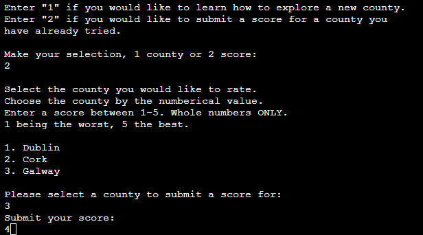

# Love Ireland

Love Ireland is an application that educates people on tour guide routes for specific counties based on their selection. Based on their choice of the counties presented to them, the user can either choose to get a detailed guide on what popular destinations of that county are listed and information like what routes to take, how long you should spend at each place, and when their closing times are, or they can rate a county they have already visited out of a score of 5. Before the user is asked to make a choice on what to do though, a list of counties and their average scores will be presented to them. If the user decides they want to learn about a county's guide, the available counties are listed to them. The full list of locations, closing times, recommended times they should spent at these locations and detailed guidance of the most popular places they should visit are given to them. They are then asked if they would like to run the app again, or if they wish to quit the application. If the user decides on restarting the app, they might then take the path previously untaken, and enter in their own score submission for one of the available counties they have visited or visited based on the information they received with their last choice.

The Love Ireland site is live, the links can be found [HERE](https://love-ireland.herokuapp.com/)

## Table of Contents
+ [UX](#ux "UX")
  + [Site Purpose](#site-purpose "Site Purpose")
  + [Site Goal](#site-goal "Site Goal")
  + [Audience](#audience "Audience")
  + [Communication](#communication "Communication")
  + [Current User Goals](#current-user-goals "Current User Goals")
  + [New User Goals](#new-user-goals "New User Goals")
+ [Design](#design "Design")
+ [Features](#features "Features")
  + [Existing Features](#existing-features "Existing Features")
+ [Testing](#testing "Testing")
  + [Validator Testing](#validator-testing "Validator Testing")
+ [Technologies Used](#technologies-used "Technologies Used")
  + [Main Languages Used](#languages-used "Languages Used")
  + [Frameworks, Libraries & Programs Used](#frameworks-libraries-programs-used "Frameworks, Libraries & Programs Used")
+ [Deployment](#deployment "Deployment")
+ [Credits](#credits "Credits")
  + [Content](#content "Content")

## UX

### Site Purpose:
To allow the users to receive a list of counties and tour guidance based on their selection. Users can also rate counties out of a score of 5 if they've already visited a county already. 

### Site Goal: 
To be a tour guide reference for the most popular counties in Ireland and showcase their average score mark out of 5, to inspire users to explore more of Ireland.

### Audience:
Anyone with an interest in travelling to Ireland or to convince somebody that is interested in travelling in general to try out Ireland. Also to attract users that have already been to get an estimate of how good these counties are. 

### Communication:
The app communicates its requirements through clear and simple print statements and prompts the user to go down 2 optional paths that can be repeated or exited upon completion.

### Current User Goals:
To bring the user back to rate a county out of 5 that the app previously gave them information and a detailed guide on. The desire is to keep the user engaged by wanting to 'complete' the app by getting tour guide references and sharing their opinion of the county after they follow that guide. The user can also restart the app with ease after they are done to rate another county if they visited twice at once.

### New User Goals:
To pick a new county to get a tour guide on, influenced by the average user score calculated by the previous users scores.

### Future Goals:
In the future I would like to implement a way for users to add counties they've visited and their own recommendations of a guided tour witht the most important locations they should visit in that area to be saved onto the app for other user's to then interact with. I would also like to add a way for the user to get a more personalised guide for the counties that I've added to the system, taking their physical abilities and time booked in that place into consideration. 

## Design

### Wireframes:

## Features

### Existing Features:

#### Landing Page:

#### Greeting and Receive a guide or rate a county:

#### Randomized Suggestion and County Selection:

#### Tour Guide:

#### Submit Score:

#### Restart or Quit app:

### Features Left to Implement
- Allow users to submit their own guides for counties that they've visited that aren't yet listed as options.
- Add a new feature that allows the user to add an extra step to the guide from information they've gathered outside of the application. Also allow them to add the location of this step to 'locations' also.
- Add links from different platforms that can give images of the locations I'm referring to so the user doesn't have to search for them outside of the app themselves. 
- Add more counties to choose to get guides from and score.
- A notes section in which the user could give their reasonings for why they gave a county the score that they did.
- Add a way to store the users name so that you don't have to repeatedly ask them for it when they restart the program and have already entered their name.

## Testing
In testing the function that is responsible for asking the user their name and prints their inputted name with a greeting, I noticed that if the user was to leave their name blank and press enter, the greeting would have an empty space in it. To tackle this issue, I added a placeholder name 'guest' to the function so that if the user was to leave the prompt blank, they would be greeted as a guest instead.

While testing the function that prints out a random selection for the user if they aren't able to make their minds up for what county they'd like to select, I noticed that the function would print out 'None' after the county name. This was due to not having a return method in the function. When I added this, I then noticed that the county name was being printed out twice as a duplicate. To fix this, I removed the print statement from the function itself, and added it to its function that it was embedded to.

In testing the function in which is responsible for allowing the user to give a a county a score out of 5, I noticed that the user was able to give a negative integer score, or a score of 0. This was a problem because it was not listed as an option in the prompts, and drastically unfairly changed the average score when the user did it. I had some trouble with this because I couldn't figure out how to word the code, but eventually realised that I had to be more specific with it and you the 'and' method as well as use the variable 'star score' twice instead of once like so 'if star_score >= 1 and star_score <= 5'

When testing the app in Heroku, I realised that I had than imported the random package into my code. I quickly done this and it resolved the issue when generating a randomly generated county for the user to choose from if they couldn't make their mind up when selecting. 
 
When testing my code through the Code Institute PEP8 testing app, I noticed that a lot of my printed statements had too many characters inside of them to fit into the maximum width that the Heroku app displays. To fix this I broke up my lines of code by adding more print statements and putting less than 80 characters in each of them.

### Validator Testing
- My code was tested with [Code Institute PEP8 Heroku Tester](https://pep8ci.herokuapp.com/).

## Technologies Used
### Languages Used
- Python